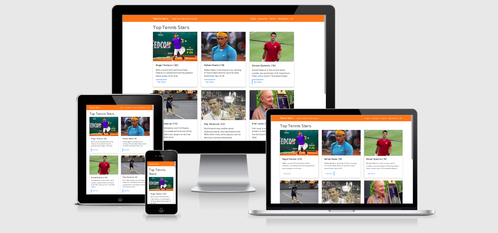

# Tennis Stars app

## Interactive Men's Tennis Champions website app
This project is the second milestone project for the Code Institute Full Stack Software Development Diploma.
Tennis Stars is an interactive website that features the champions and records of modern men's professional tennis, since the Open Era of professional tennis began in 1968. The app is designed to appeal to tennis fans, journalists, historians and anyone with an interest in modern men's tennis history. The homepage features the top seven male stars from 1968 to the present day. There is also a chart.js graph that lists the all time champions. The tournament records of the four Grand Slams (Wimbledon, French, Australian and US Opens) can be viewed in table format with searchbox and pagination functionality. Please click on the following link to view the app: [Tennis Stars](https://ey7.github.io/project-two).  

 ## Design Planning

Please view the [project strategy document](planning.md) for the website, which details the project strategy, including the project planning of the UX and UI, customer stories, scope, structure, skeleton and surface. I used [Figma](https://www.figma.com) for the intial website design of the homepage. [Mobile view design](https://www.figma.com/file/IHMmjFHnGdtrWzdgJUOkhr/Interactive-Frontend-Mobile-View?node-id=0%3A1).
[Desktop View Design](https://www.figma.com/file/bhWl1GftpCrjnhSJfQ3AUI/Interactive-Frontend-Desktop-View).

  - The website homepage will feature the main 7 biggest tennis champions of the modern era, with popout modals that display individual stats.
  - The aim is for an interactive, simple, easy to use website that allows tennis fans and those interested in tennis history to browse the records of the modern champions, and the records from the four Grand Slam tournaments, held each year.
  - An interative graph of champions will be available, as well as individual records pages for the four main tournaments of the Australian Open, French Open, Wimbledon and the US Open.
  - There is no tennis api available so the records will be hard coded into individual json files that use xmlhttprequests to display to their respective pages. Due to the amount of work involved, records will be limited to men champions in the modern era from 1968.
  - Champions search functionality and pagination on the tournament records pages will also be implemented.

## Website Content

The website consists of six pages, including a homepage, four tournament records pages and a visual graph page featuring a bar chart.

## Website Style

- One colour theme of orange on the navbar and table headers with blue on the buttons throughout for visual consistency. 
- A modern sans serif font of Exo 2 throughout.
- A white background with dark grey text for optimum readability.

## Website Features

- Pop out modals on the homepage that display the key stats for major champions.
- A responsive visual bar chart that lists the records of the seven biggest champions of the Open Era.
- Responsive navigation with "hamburger" drop down menu icon for small and medium screens.
- Pagination implemented with javascript on records pages, limited to 10 records per page.
- Search functionality for tennis champions on records tables with javascript, the user can search for a particular champions and find the year in which he was champion, if any.
- With no tennis api available, 4 x hard coded JSON files with XMLHTTPRequests will load the records to the individual pages.

## Technologies Used

- CSS Flexbox for website layout and design.
- [Bootstrap](https://getbootstrap.com/) for modern styling with responsive navigation, tables and cards. 
- Javascript for implementation of JSON files, pagination, button and search functionality.
- [Jquery](https://jquery.com/) and [Popper Js](https://popper.js.org/) for Bootstrap functionality.
- [Google fonts](https://fonts.google.com/) for fast loading on Exo 2 font.
- [JSON](https://json.org/) for building a quasi database of records in JSON that can be loaded to individual pages.
- [Chart JS](https://www.chartjs.org/) for the development of the visual graph that displays the biggest modern tennis champions.
-	[Github Pages (https://pages.github.com/) to host the site.
- [Figma](https://www.figma.com) for mock ups of the site.
  
## Resources

- [Stackoverflow](https://stackoverflow.com/)
- [MDN Mozilla Docs](https://developer.mozilla.org/en-US/)
- [W3 Schools](https://www.w3schools.com/)
- [CSS Tricks](https://css-tricks.com/)
- [Responsinator](https://www.responsinator.com/)
- [Am I Responsive](http://ami.responsivedesign.is/)
- Google
  
## Testing

- The app was tested using developer tools throughout the project on multiple browsers - Chrome, Mozilla & Opera etc.
- The developer console was used throughout the project to check for javascript errors and issues.
- The links and buttons on all pages were manually tested to ensure everything was working correctly.
- All breakpoints were tested for different screen sizes and viewports.
- The app was tested on [Responsinator](https://www.responsinator.com/) and [Am I Responsive](http://ami.responsivedesign.is/) to ensure that the site pages were rendering correctly on all types of devices and orientations, such as Ipad and Iphone.
- The app was put through the [HTML5 Validator](https://validator.w3.org/) and some errors and warnings related to stray tags and duplicate ids were fixed.
- The app was put through [CSS Validator](https://jigsaw.w3.org/css-validator/) and some errors were uncovered related to the bootstrap css which is not something that I can control. My own css code was error free.
- I also tested the website on [google mobile friendly](https://search.google.com/test/mobile-friendly) and recieved a mobile friendly result. 
- I tested the website on personal and other family devices such as my laptop and android mobile phone, iPad and iPhone and Samsung Galaxy Tab in both potrait and landscape orientations.

## Deployment

- I decided to use [Github Pages (https://pages.github.com/) to deploy the site, which allows for free, easy integrated and continuous deployment from my github repository. 
- Github pages also provides some nice free features such as HTTPS, for security.
- The first step is to set up a git repository on GitHub, with all the files needed, such as HTML, CSS, JS and images.
- On the GitHub repository page, I clicked on settings, then on the settings page move to the GitHub Pages section.
- I changed the source to master branch, so it would deploy directly from the master branch.
- Under environments, a link was provided to my Github Pages hosted website.

## Issues

1. On deployment to GH Pages the images, scripts and css stylesheets were not loading to the site pages.
2. The chart.js graph was not displaying correctly at small screen sizes.
3. On small screen sizes, the search button on the tournament pages had no margin bottom and looked squashed.
4. On medium screen sizes the navbar did not render correctly with too many elements displaying.
5. On small screen sizes below 400px the tables were not responsive and the right hand table content was not visible.
6. The Chart JS will only render font that is installed on the user's machine and will not work with google fonts.
7. On long pages I realised that there is no way for the user to quickly scroll to the top of the page.
8. There was four individual JSON files with four individual XMLHTTPRequests for each page to load the content. I needed to find a way to add an if statement to reduce code repetition.
9. Search functionality worked well on the records pages but when a search was made and the backspace button was used to clear the searchbox, on some devices the page was then no longer paginated, and you had a long list of 50 something records scrolling down the page.

## Investigation and resolution of issues

1. After further research I realised that the path to the css, js and images needed to be changed in order for them to function correctly on Github Pages. A process of trial and error yielded the correct result.
2. After some tinkering I gave the the container for the chart a position of relative, then changed the view width and height. I also set "maintain aspect ratio" on the chart to false in order for the chart to render correctly on small screens.
3. I added a margin bottom to the search button that worked on some devices. However on other devices the search button displays inline with the input box and the margin bottom disrupts the button's page alignment.
4. I changed the bootstrap code to make the navbar hamburger icon menu appear at medium screen sizes.
5. I modified the bootstrap code to make the tables more compact and responsive at small screen sizes.
6. I was not able to match up the font on the Chart to Exo 2 and settled for a generic arial font which works but is not ideal from an aesthethic point of view.
7. I added a scroll to top arrow, by modifying an example from W3 Schools with an svg arrow instead of a button.
8. Still under investigation. From some research, I understand that frameworks ike React make this easier to implement.
9. Still under investigation, it does not appear to be an issue on all devices.

## Further improvements to be made to site

- I would like to add further champions and records to the site.
- I would like if possible to add womens records as well.
- In the future I would like to enhance the search functionality, so that the user could search for year, or even country records.

## Image credits

- Card images (x7) with creative commons license on home page courtesy of [flickr](https://www.flickr.com/).
- The flag icons for the popout modals were sourced for free from [country flags](https://www.countryflags.com/).
- The tennis ball favicon for the site was downloaded for free from [iconscout](https://iconscout.com/icon/game-sports-sport-tennis-ball-play-6).
- The svg icon for the scroll to top arrow was taken for free from [iconscout](https://iconscout.com).

## Acknowledgements

- I did not want to reinvent the wheel and used [pagination js](https://pagination.js.org/) for the pagination functionality, and included a minified version of their script.

- I used the search script to filter a table from [W3 Schools](https://www.w3schools.com/howto/howto_js_filter_table.asp), to implement the search functionality on the tennis records tables.

- Thanks to [W3 Schools](https://www.w3schools.com/howto/howto_js_scroll_to_top.asp) for their example of the implementation of the scroll to top button. I modified their example for my own app with an svg arrow.
  
- Thanks to [Chart JS](https://www.chartjs.org/) for a simple and easy to use visual chart implementation for the bar chart on the graph.html page. I tweaked and modified their base example to suit my needs, and was pleased with the result.

## How to deploy your own version of the website

 - Ensure that git is installed on your machine.
 - Visit the repository, and Click 'Clone or download' and copy the code for http.
 - Open a terminal in your root directory, i.e. the directory where you want to download the website files.
 - Type 'git clone ' followed by the link for the github repository that you want to clone/download, for example 
 	git clone https://github.com/ey7/project-two.git
 - When this completes you have your own version of the website, which you are free to alter as you wish.
 - Enjoy!

